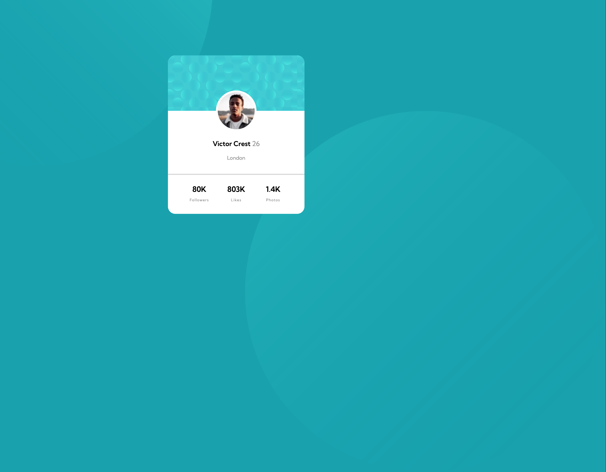
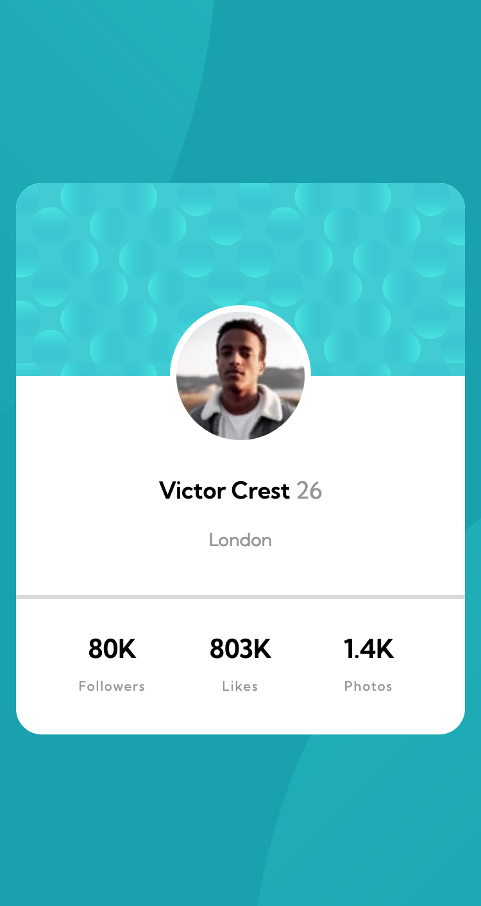

# Frontend Mentor - Profile card component solution

This is a solution to the [Profile card component challenge on Frontend Mentor](https://www.frontendmentor.io/challenges/profile-card-component-cfArpWshJ). Frontend Mentor challenges help you improve your coding skills by building realistic projects. 

## Table of contents

- [Overview](#overview)
  - [The challenge](#the-challenge)
  - [Screenshot](#screenshot)
  - [Links](#links)https://github.com/mini0222/profile-card/blob/main/README.md
- [My process](#my-process)
  - [Built with](#built-with)
  - [What I learned](#what-i-learned)


## Overview

### The challenge

- Build out the project to the designs provided

### Screenshot

 |



### Links

- Solution URL: [Add solution URL here](https://your-solution-url.com)
- Live Site URL: [Add live site URL here](https://your-live-site-url.com)

## My process

### Built with

- Semantic HTML5 markup
- CSS custom properties


### What I learned

I discovered how to position elements on top of others using margins. It's fascinating – not only can you create space between elements, but you can also precisely position an element over others. For instance, I utilized this technique to center the profile picture perfectly within the profile card.


```css

.profile img {
    height: 100px;
    margin-top: -55px;
    border-radius:  100px;
    padding: 5px;
    background: white;
}
```


